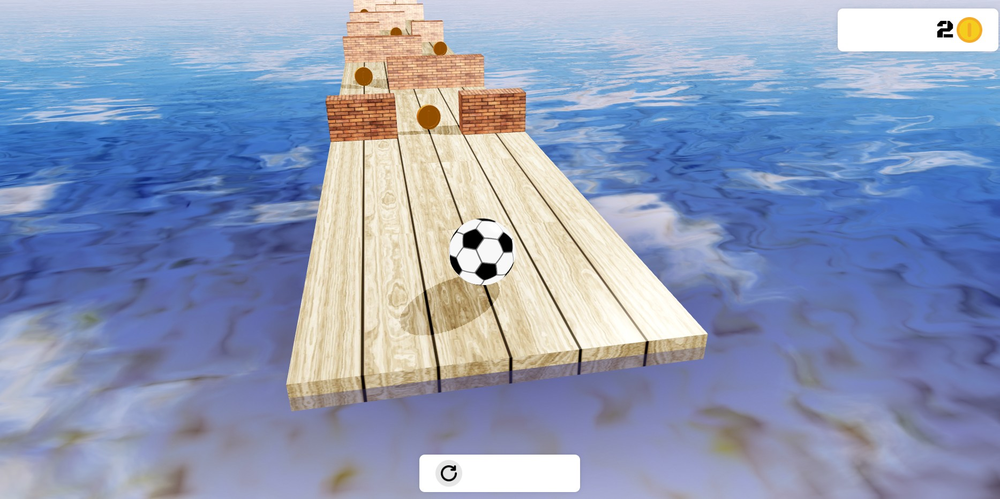

# Simple Ball Running 3D Game

---

### [[LIVE DEMO]: running-ball-babylonjs-by-user-of-github.netlify.app](https://running-ball-babylonjs-by-user-of-github.netlify.app/)  

__Attention__: Adapted for desktop and mobile devices. On desktop use arrows or keys A/D to move left/right. On mobile just use taps (touches) to bottom-left or bottom-right part of the screen to translate the ball. On mobile ball is just translated to one of 3 roads, while on desktop it is moved via impulse.

---

## Technologies:

- [TypeScript](https://www.typescriptlang.org/)
- [Babylon.js](https://www.babylonjs.com/)
- [Vite](https://vite.dev/)
- [GitHub Actions CI](https://github.com/features/actions) with [Netlify](https://www.netlify.com/)

---

