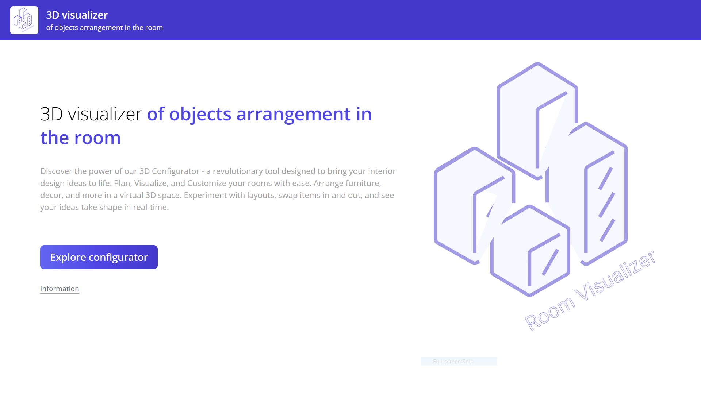
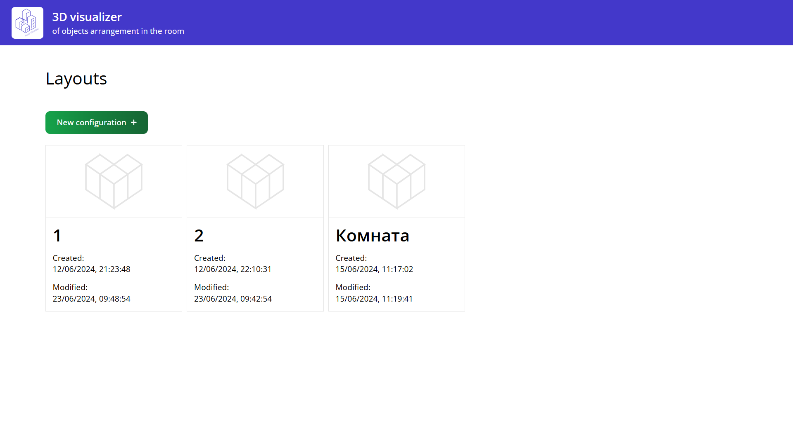
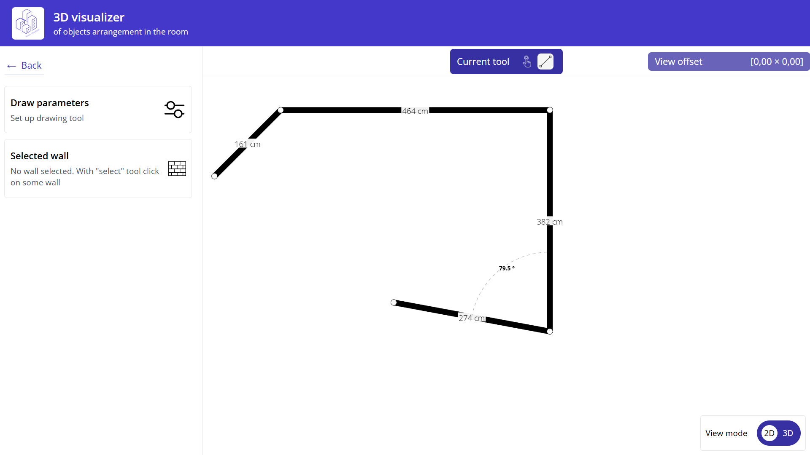
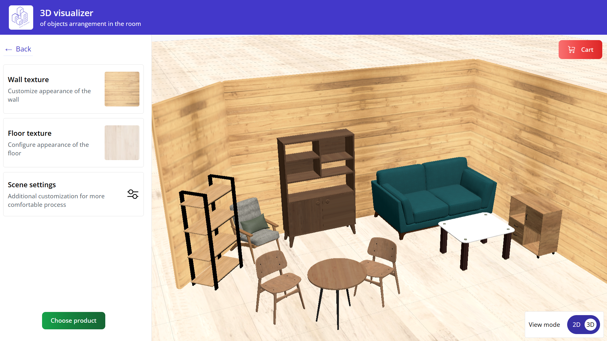

# Visual arrangement of tools in room application  
___  
## Packages:  
- _Web_  
___  
### To set up:  
`npm install` from monorepo root folder   

and same for all repos for now :(
___  

### Web 
UI for application. Single page application with drawing-walls mode and objects-arrangement mode. As well as with localization.
#### Technologies:  
- _[React](https://react.dev/)_  
- _[TypeScript](https://www.typescriptlang.org/)_  
- _[Vite](https://vitejs.dev/)_  
- _[Tailwind CSS](https://tailwindcss.com/)_  
- _[MobX](https://mobx.js.org/README.html)_   
- _[Canvas API](https://developer.mozilla.org/en-US/docs/Web/API/Canvas_API)_  
- **_[Three.js WebGL](https://threejs.org/)_**  
- _[React Intl](https://formatjs.io/docs/react-intl/)_

##### Additional (but also important)
- _[ESLint](https://eslint.org/)_  
- _[Prettier](https://prettier.io/)_  
- _[ESLint Stylistic](https://eslint.style/)_
- _[GitHub Actions CI/CD](https://github.com/features/actions)_  
- _[Husky](https://typicode.github.io/husky/)_  
- _[Node.js](https://nodejs.org/)_

### Dev Features:  
- _Auto pipeline for deploy via [GitHub Actions CI](https://github.com/features/actions) on [Vercel](https://vercel.com/)_
- _Pre-commit hook for code-formatting via [Husky](https://typicode.github.io/husky/)_  
- _[Node.js](https://nodejs.org/) Script for compressing images for previews on UI (textures)_  

___  
## Demo
  
  
  
  
